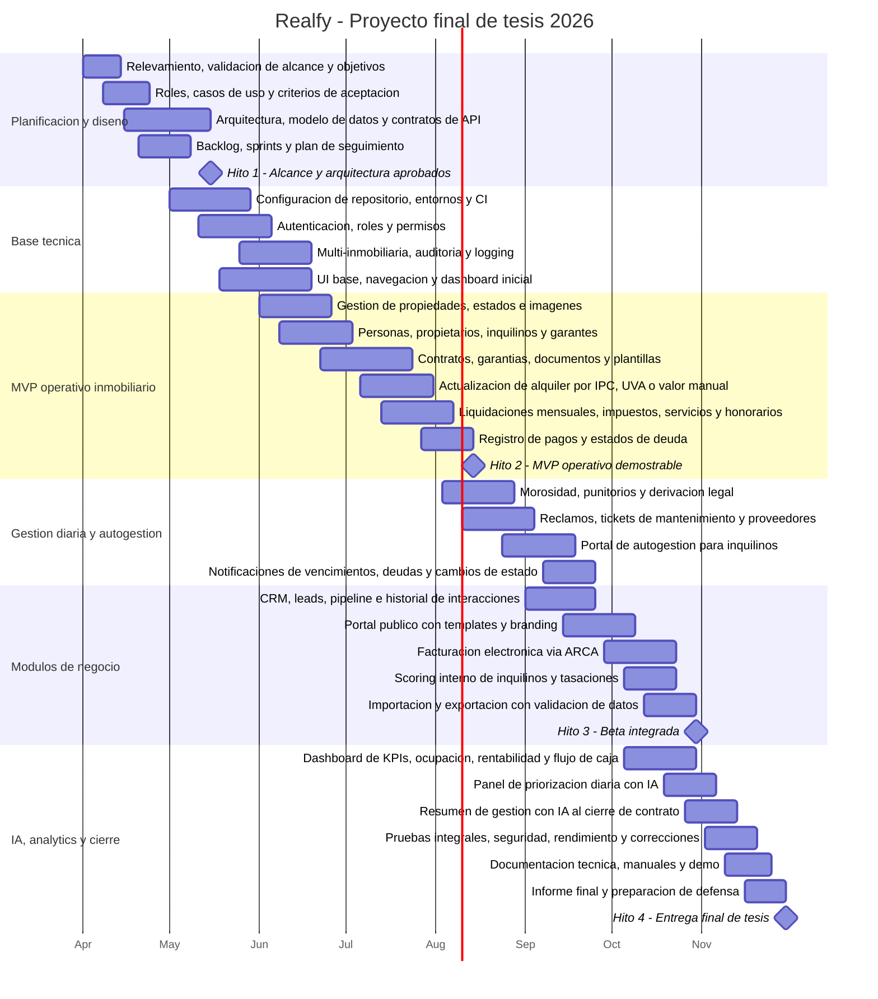

# Realfy - Diagrama de Gantt del proyecto final

Duracion total: 8 meses  
Periodo propuesto: abril a noviembre de 2026  
Fuente de alcance: anteproyecto REALFY y presentacion Realfy.pptx

## Criterio de planificacion

El cronograma esta organizado para una tesis de software con entregas incrementales. Primero se cierra el alcance y la arquitectura, luego se construye el nucleo operativo de gestion inmobiliaria, despues se integran los modulos de negocio y finalmente se completa la inteligencia artificial, analytics, pruebas, documentacion y presentacion final.

No se incluyen funcionalidades declaradas fuera de alcance en el anteproyecto: firma digital certificada, aplicacion movil nativa, publicacion en portales externos, operacion fuera de Argentina, consulta automatica de deuda en organismos recaudadores, scoring cruzado entre inmobiliarias ni prediccion de precios de mercado con modelos externos.

## Gantt

## Vista por meses

| Etapa / actividad principal | Abr | May | Jun | Jul | Ago | Sep | Oct | Nov | Entregable |
|---|:---:|:---:|:---:|:---:|:---:|:---:|:---:|:---:|---|
| Relevamiento, alcance, objetivos y casos de uso | X | X |  |  |  |  |  |  | Alcance funcional aprobado |
| Arquitectura, modelo de datos, APIs y backlog | X | X |  |  |  |  |  |  | Diseno tecnico y plan de sprints |
| Repositorio, entornos, CI, autenticacion y roles |  | X | X |  |  |  |  |  | Base tecnica operativa |
| Multi-inmobiliaria, auditoria, logging y UI base |  | X | X |  |  |  |  |  | Plataforma base navegable |
| Propiedades, estados, imagenes y busquedas |  |  | X |  |  |  |  |  | Modulo de propiedades |
| Personas, propietarios, inquilinos y garantes |  |  | X | X |  |  |  |  | Gestion de actores |
| Contratos, garantias, documentos y plantillas |  |  | X | X |  |  |  |  | Modulo de contratos |
| Actualizacion de alquiler por IPC, UVA o manual |  |  |  | X |  |  |  |  | Motor de actualizacion |
| Liquidaciones, impuestos, servicios y honorarios |  |  |  | X | X |  |  |  | Liquidacion mensual automatizada |
| Pagos, deuda, morosidad y punitorios |  |  |  | X | X |  |  |  | Gestion de cobranzas |
| Reclamos, tickets de mantenimiento y proveedores |  |  |  |  | X | X |  |  | Trazabilidad de mantenimiento |
| Portal de autogestion del inquilino |  |  |  |  | X | X |  |  | Portal con liquidaciones, pagos y tickets |
| Notificaciones automaticas |  |  |  |  |  | X |  |  | Alertas de vencimientos y cambios |
| CRM, leads, pipeline e interacciones |  |  |  |  |  | X |  |  | Gestion comercial |
| Portal publico personalizable |  |  |  |  |  | X | X |  | Publicacion propia de propiedades |
| Facturacion electronica via ARCA |  |  |  |  |  |  | X |  | Comprobantes electronicos |
| Scoring interno, tasaciones e importacion/exportacion |  |  |  |  |  |  | X |  | Modulos complementarios de gestion |
| Dashboard de analytics |  |  |  |  |  |  | X |  | KPIs de ocupacion, rentabilidad y caja |
| Panel de priorizacion diaria y resumen IA de contratos |  |  |  |  |  |  | X | X | Funciones de asistencia con IA |
| Pruebas integrales, seguridad, rendimiento y correcciones |  |  |  |  |  |  |  | X | Version candidata a entrega |
| Documentacion, demo, informe final y defensa |  |  |  |  |  |  |  | X | Entrega final de tesis |

## Hitos principales

| Fecha | Hito | Criterio de aceptacion |
|---|---|---|
| 15/05/2026 | Alcance y arquitectura aprobados | Roles, casos de uso, modelo de datos, APIs iniciales y backlog priorizado. |
| 14/08/2026 | MVP operativo demostrable | Propiedades, personas, contratos, actualizacion de alquileres, liquidaciones y pagos funcionando en entorno de prueba. |
| 30/10/2026 | Beta integrada | Gestion diaria, portal de inquilino, CRM, portal publico, facturacion ARCA, analytics y modulos complementarios integrados. |
| 30/11/2026 | Entrega final de tesis | Sistema probado, documentado, con demo preparada e informe final listo para presentacion. |

## Cadencia sugerida

- Sprints de 2 semanas con revision funcional al cierre de cada sprint.
- Demo mensual asociada a cada hito de avance.
- Congelamiento de alcance funcional al finalizar mayo para proteger la entrega de tesis.
- Noviembre reservado para integracion, correcciones, documentacion y defensa, evitando sumar nuevas funcionalidades en el cierre.
